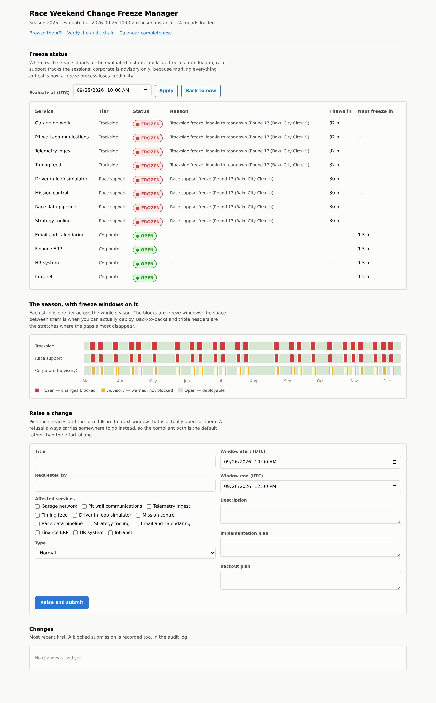
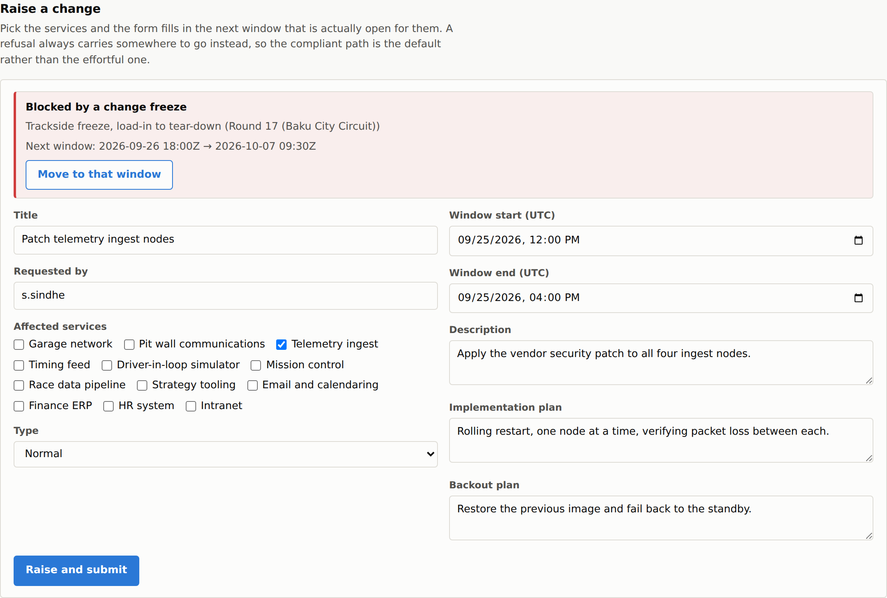
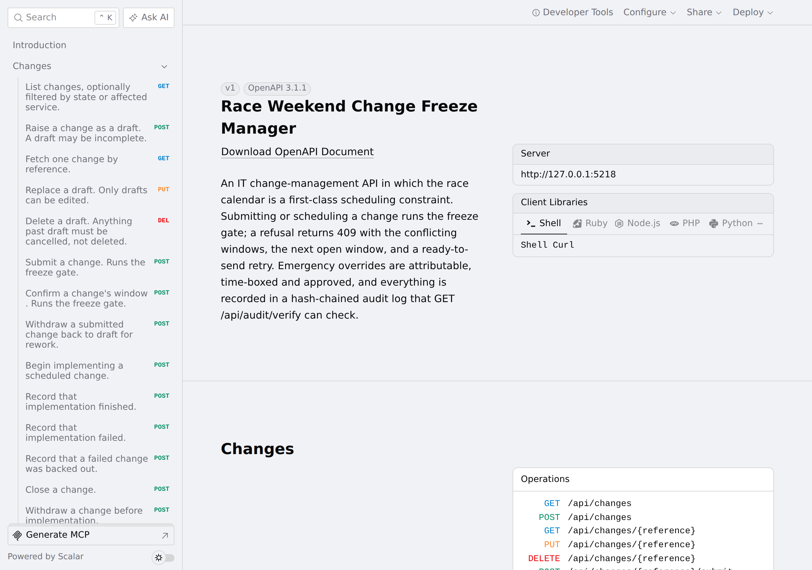
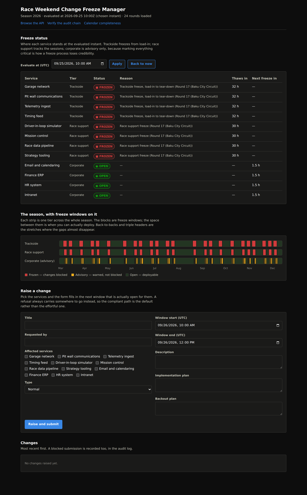

# Race Weekend Change Freeze Manager

[](https://github.com/Sachin-1712/carlos-sainz/actions/workflows/ci.yml)

An IT change-management system in which **the race calendar is a first-class scheduling
constraint**.

Engineers raise change requests against IT services. The system knows when every session of every
race weekend starts and ends, derives freeze windows from that calendar according to per-service
policy, and refuses to let a change be scheduled into one. Emergencies still get through, but only
via a time-boxed override that costs a named approval chain, a linked incident, and a permanent,
tamper-evident audit entry.



> **Portfolio project.** Not affiliated with, endorsed by, or derived from any Formula 1 team's
> internal systems. All data is seeded or fetched from public sources.

## Why the calendar matters

Corporate IT change freezes are calendars of convenience: month-end, Black Friday, the Christmas
shutdown. Someone picks them, and someone can move them.

A racing team's freeze is different. It is externally imposed, non-negotiable, and it moves without
asking. The FIA publishes when you are allowed to break things. Nobody in your change process gets
a vote, and a session that slips because of weather drags every dependent freeze window with it.

That single difference is what this project is built around.

## A refusal that is worth obeying

The hard part of change control is not blocking things. It is being a control people use rather
than route around — and a control that is routed around also stops telling you the truth about what
is being changed.

So a refusal here always carries somewhere to go instead. Over HTTP, a blocked submission returns
`409` with the conflicting windows, the next window long enough for *this* change, and a
`retryWith` object that is a complete request which would succeed:

```json
{
  "title": "Blocked by a change freeze",
  "detail": "Blocked by 1 freeze window(s); next window opens 2026-09-26 18:00Z",
  "conflicts": [
    { "reason": "Trackside freeze, load-in to tear-down (Round 17 (Baku City Circuit))", "rounds": [17] }
  ],
  "suggestedOpenWindow": { "startUtc": "2026-09-26T18:00:00+00:00", "durationHours": 255.5 },
  "retryWith": {
    "method": "POST",
    "path": "/api/changes/CHG-2026-0001/submit",
    "body": {
      "requestedStartUtc": "2026-09-26T18:00:00+00:00",
      "requestedEndUtc": "2026-09-26T22:00:00+00:00"
    }
  }
}
```

Posting `retryWith` back unmodified moves the change and submits it. Note it keeps the change's own
four hours rather than expanding to fill the 255-hour gap.

In the dashboard the same idea arrives one step earlier: ticking a service shows the next open
window *before* anyone types a date, so the compliant path is the lazy one.



## Design decisions worth reading

The full set is in [`docs/decisions.md`](docs/decisions.md) — 42 entries, each written as *what was
chosen, why, what it would cost to get wrong, and the sentence to open with if asked*. The ones
that shaped everything else:

**Parc fermé is stored as data, not computed in code.** The shape of parc fermé on a sprint weekend
has changed more than once as the sporting regulations were revised. If the rule lives in an `if`,
a regulation change becomes a code change and a release. If it lives in the calendar, it becomes an
edit by a duty manager.

**Freeze scope is tiered, not global.** Trackside systems freeze from load-in. Race-support systems
track the sessions. Corporate IT gets an advisory warning and nothing more, because marking every
service business-critical is how a freeze process loses credibility and starts getting bypassed.

**Missing data lengthens the freeze; it never shortens it.** An anchor that cannot be resolved —
parc fermé times published late, say — falls back rather than silently yielding no window.

**Everything is UTC internally.** The US and Europe change their clocks on different weekends. For
about a week each spring and autumn, code that thinks in "local time" is an hour wrong at one end
of the telemetry link. Instants do not have this problem.

**A missing round is the one thing that cannot fail safe, so it is shouted about.** Nothing inside
the engine can over-freeze for an event it has never seen. Startup warns, and
`/api/calendar/{season}/completeness` returns `409` naming the rounds and which of two causes
applies — ingestion dropped it, or upstream never sent it.

## What the tests prove

**328 tests**, no mocks in the domain suite, no clock, no I/O. Each is a statement about the
domain; these are the ones worth reading:

- Back-to-back races leave a 65-hour window for trackside services and nothing more.
- A triple header has no gap long enough for a four-day change, so the engine pushes it past all
  three rounds rather than offering a window that does not fit.
- A sprint weekend's two parc fermé windows open a gap for the race engineers, not for IT.
- A session delayed forty-five minutes by a red flag drags its freeze out with it.
- A Saturday-night race in Las Vegas keeps a European factory frozen into Sunday morning.
- The same weekend described in UTC, US central and Japan standard time produces byte-identical
  freeze windows.
- A change that spans a freeze is blocked, never silently trimmed; one that ends exactly as a
  freeze begins is allowed.
- An unknown service name fails the gate closed, so a typo cannot buy an exemption.
- Every state in the lifecycle is reachable from `Draft`, so a state added to the enum without
  being wired into the transition table fails the build.
- Approvals are discarded when a change goes back to draft, so nobody approves a one-line config
  edit and has it apply to the schema migration it was rewritten as.
- An audit row cannot be updated or deleted through the application at all; edited directly in the
  database, the hash chain names the entry that changed.
- Editing one entry and honestly recomputing its hash is still caught — by the *next* entry's
  back-link.
- An override that expires unused is written to the log exactly once, however often the sweeper
  runs, so the expiry is history rather than an inference from the clock.

## The lifecycle

```
Draft -> Submitted -> Approved -> Scheduled -> Implementing -> Implemented -> Closed
   |          |           |            |             |
   |          +-> Rejected|            +-> Approved  +-> Failed -> RolledBack -> Closed
   |          |           |                                |
   |          +-> Draft <-+--------------------------------+
   |
   +-> Cancelled
```

The freeze gate runs on `Draft -> Submitted` and `Approved -> Scheduled` — the two points at which
a window is claimed. Approval sits between them and does not re-run the gate, because approving a
change agrees to the work, not to the slot. The transitions are a table rather than a chain of
conditionals, which is why inserting the approval states was an edit to data.

## Approvals, overrides and the audit trail

### The chain scales with the blast radius

| Strictest tier touched | Who has to approve |
| --- | --- |
| Corporate | Service owner |
| Race support | Service owner, head of IT |
| Trackside | Trackside IT lead, head of IT, race engineering nominee |

Trackside adds race engineering because touching a trackside system during a session has sporting
consequences, not only IT ones. A standard change is pre-approved and skips the chain — but it is
still subject to the freeze, and an override for one still needs an approver.

### Emergency override

The only way through a freeze, and a control rather than a bypass because it is three things at
once:

- **Attributable** — a linked incident reference and a written justification, both required.
- **Time-boxed** — a grant expires on its own (two hours by default, twelve maximum), and the
  expiry is written to the audit log by a sweeper, so a standing exemption cannot accumulate.
- **Accountable** — it takes the same approval chain the change's tier demands.

**Break-glass** is the narrower door for when the chain cannot be assembled at 02:00: one approver,
but only the head of IT or the trackside IT lead, and it costs a mandatory retrospective within 24
hours. It exists because the alternative is people working around the tool entirely.

### What an emergency looks like in the log

Raising an emergency change during a race weekend, being refused, overriding it and going ahead
produces this, each entry hash-linked to the one before it:

```
#1   ChangeRaised               s.sindhe                 98f818472d... <- 0000000000...
#2   ChangeBlockedByFreeze      s.sindhe                 36cd3bb86a... <- 98f818472d...
#3   OverrideRequested          s.sindhe                 15a0e12014... <- 36cd3bb86a...
#4   OverrideApprovalRecorded   TracksideItLead.person   bd84e63341... <- 15a0e12014...
#5   OverrideApprovalRecorded   HeadOfIt.person          065716aa3c... <- bd84e63341...
#6   ChangeBlockedByFreeze      s.sindhe                 ec72418810... <- 065716aa3c...
#7   OverrideApprovalRecorded   r.nominee                87b6112218... <- ec72418810...
#8   OverrideGranted            r.nominee                23957750f2... <- 87b6112218...
#9   OverrideUsed               s.sindhe                 5f819fdea0... <- 23957750f2...
#10  ChangeSubmitted            s.sindhe                 e1d5575bdc... <- 5f819fdea0...
```

Both refused attempts (#2, #6) are in the log. A refusal is exactly the thing a change process needs
to be able to count later: a rising number of them says a freeze policy is wrong somewhere.

### Tamper evidence, and its limits

`GET /api/audit/verify` walks the chain. Editing a row directly in the database — behind the
application, where the append-only interceptor cannot reach — is caught:

```
HTTP 409
  isValid:             False
  firstBrokenSequence: 3
  reason:              Entry 3 has been altered: the stored hash does not match its contents.
```

Two layers: a `SaveChanges` interceptor refuses any update or delete of an audit row, and the hash
chain catches anyone who goes around it.

The honest claim is **detection, not prevention**. Someone with write access could recompute the
whole chain, and entries removed from the *end* cannot be detected by a chain alone — nothing links
forward. The verify response says so in a `scope` field rather than letting a green tick be
over-read.

## Running it

Requires the .NET 10 SDK. No other tooling — no npm, no bundler.

```bash
dotnet run --project src/FreezeManager.Api
```

| | |
| --- | --- |
| `/` | The dashboard |
| `/scalar/v1` | Browsable API reference |
| `/api/audit/verify` | Walk the audit hash chain |
| `/api/calendar/2026/completeness` | Check the calendar for holes |

On first run it applies migrations, seeds the service catalogue, and pulls the calendar — live if
the API is reachable, from the bundled seed if not. Either way the attempt is recorded and readable
at `GET /api/calendar/sync-runs`, including the reason for a fallback.



## Things that are placeholders, deliberately

**Tier policy offsets are not yet set.** `FreezePolicySet.Default` freezes trackside from 48 hours
before the first session to 2 hours after parc fermé release, race support from 24 hours before to
3 hours after the race, and gives corporate a 30-minute advisory margin around each session. Those
numbers are plausible, not decided: they exist so the engine has something to run and are **to be
set by the service owner**. They are data, not code — one edit in `FreezePolicySet.cs`.

**"Verified" means provenance, not review.** A row is `IsVerified = true` when it **came from a
published source** — the live upstream API — and `false` when it did not. It does **not** mean a
person has checked it. The flag answers "where did this come from?", which is the question that
matters when a freeze window looks wrong at 06:00.

**The live provider is the normal source of calendar data, and is verified against the real API.**
A live sync pulls the real season — rounds, circuits and published session times — and those are
the dates the freeze windows are computed from in ordinary operation.

**The bundled seed is a cold-start fallback only.** `data/seed/calendar-2026.json` was generated by
`tools/generate-seed-calendar.py` from a hand-written table and a standard session timetable. None
of it has been checked against the official calendar. It exists so the tool still works when the
upstream API is unreachable, and so CI is deterministic — not as a source of truth. Every seeded
event carries `verified: false` and keeps that flag in the database, so a fallback calendar can
never be mistaken for a real one.

**There is no authentication.** Roles are supplied by the caller. Wiring this to real identity is
the first thing production would need, and is deliberately out of scope.

## Architecture

```
src/
  FreezeManager.Domain/          pure C#, zero dependencies — freeze engine, lifecycle, audit chain
  FreezeManager.Infrastructure/  EF Core over SQLite, calendar providers, sync, audit writer
  FreezeManager.Api/             minimal API, Scalar, and the Blazor dashboard
tests/
  FreezeManager.Domain.Tests/          fast, deterministic, no I/O
  FreezeManager.Infrastructure.Tests/  in-memory SQLite through the real migrations
  FreezeManager.Api.Tests/             the real HTTP surface, in-memory database
data/seed/                       unverified calendar, illustrative service catalogue
docs/decisions.md                the design decisions, one entry each
```

The domain project has no dependency on EF Core, ASP.NET, HTTP, or the system clock. The freeze
engine is a pure function of `(calendar, service tiers, instant)`, which is what makes the test
suite readable as a statement of the domain rather than a set of mocks — and what let the dashboard
add "evaluate at any instant" for the cost of a query parameter.

### Calendar ingestion

`IRaceCalendarProvider` has two implementations. `JolpicaCalendarProvider` reads the live API
(Ergast-compatible response shape). `SeedCalendarProvider` reads the bundled file.
`FallbackCalendarProvider` tries the first and, on any failure, uses the second and says so in the
sync history. `CalendarSyncService` reconciles what a provider returns into the database: it
refreshes scheduled times, never overwrites actual times a person recorded, keeps parc fermé
windows a person entered, and skips any event an admin has pinned.

The upstream API publishes session start times only. Durations and parc fermé are filled from
`IngestionDefaults`, and every derived parc fermé window is stamped as derived so a person can tell
a rule's output from a published fact.

Two things an operator has to act on are returned as their own fields rather than buried in warning
prose: `unmappedCircuitIds` (each one a row to add to the time-zone table) and `skippedRounds`
(each one a round upstream sent that could not be stored, with the reason).

### One word per meaning

A freeze window and an open window are opposites, so nothing in the API is called just "window".
Any field holding a period when work is **blocked** says `freezeWindow`; any field holding a period
when work is **allowed** says `openWindow`. The domain types use the same names, so there is no
translation step between them where a mistake could hide.

### Endpoints

| | |
| --- | --- |
| `POST /api/changes` | Raise a draft. A draft may be incomplete. |
| `GET /api/changes?state=&affectedService=` | List, filtered. |
| `GET` `PUT` `DELETE` `/api/changes/{ref}` | Fetch, replace, delete. Only drafts can be edited or deleted. |
| `POST /api/changes/{ref}/submit` | Runs the freeze gate. Accepts an optional replacement window. |
| `POST /api/changes/{ref}/schedule` | Runs the freeze gate. Accepts an optional replacement window. |
| `POST /api/changes/{ref}/{withdraw,start,complete,fail,roll-back,close,cancel}` | The rest of the lifecycle. |
| `GET` `POST` `/api/changes/{ref}/approvals` | The chain this change needs; record one role's decision. |
| `GET` `POST` `/api/changes/{ref}/override` | Overrides raised; raise an emergency override. |
| `POST /api/changes/{ref}/override/approvals` | Approve or reject an override. |
| `POST /api/changes/{ref}/override/revoke` | Withdraw an override before it expires. |
| `POST /api/changes/{ref}/override/retrospective` | Complete the retrospective a break-glass owes. |
| `GET /api/freeze/status?serviceKey=&at=` | Is this service frozen, and for how long. Returns `activeFreezeWindow` / `nextFreezeWindow`. |
| `GET /api/freeze/next-open-window?serviceKey=&hours=` | When could a change of this length run. |
| `GET /api/freeze/windows?serviceKey=` | Every freeze window for a service, merged. |
| `GET /api/calendar/{season}` | The stored calendar, with each event's provenance. |
| `GET /api/calendar/{season}/completeness` | Missing or incomplete rounds, and which cause applies. |
| `POST /api/calendar/{season}/sync` | Pull from the provider and reconcile. |
| `GET /api/audit?subject=` | The audit log, in sequence order. |
| `GET /api/audit/verify` | Walk the hash chain and report any alteration. |
| `POST /api/audit/sweep-overrides` | Run the expiry sweep now. Also runs on a timer. |

## Build

```bash
dotnet restore FreezeManager.slnx
dotnet build FreezeManager.slnx --configuration Release
dotnet test FreezeManager.slnx --configuration Release
```

Warnings are errors. One test calls the real calendar API and is skipped by default so CI and
offline runs stay deterministic; to run it from a machine that can reach `api.jolpi.ca`:

```bash
FREEZE_LIVE_TESTS=1 dotnet test tests/FreezeManager.Infrastructure.Tests --filter LiveJolpica
```

Schema changes go through EF Core migrations (`dotnet tool install --global dotnet-ef`, then
`dotnet ef migrations add <Name> --project src/FreezeManager.Infrastructure --startup-project
src/FreezeManager.Infrastructure --output-dir Persistence/Migrations`). The infrastructure tests
build their in-memory database through the migrations, so a migration that does not match the
model fails the suite.

## Status

Built in phases, one review at the end of each.

| Phase | Scope | Status |
| --- | --- | --- |
| 0 | Repository scaffold, CI | Done |
| 1 | Domain: race calendar model, freeze engine, test suite | Done |
| 2 | Persistence, calendar ingestion (live provider with seeded fallback) | Done |
| 3 | API: change request lifecycle and freeze gate | Done |
| 4 | Approval chains, emergency override, audit hash chain | Done |
| 5 | Freeze dashboard, browsable API, calendar completeness | Done |
| 6 | README and screenshots | Done |

## Notes

Tests use xUnit with its built-in assertions and no third-party assertion library, to keep the test
project free of the licence change that affected FluentAssertions v8.

The dashboard's status colours come from a validated palette; because the warning step sits below
3:1 contrast on a light surface by design, every status mark carries an icon and a word as well as
a colour, so colour is never the only signal. It follows the viewer's theme, with the dark steps
chosen against the dark surface rather than flipped:


